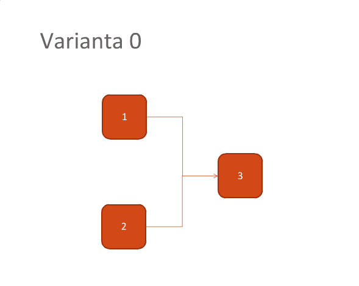
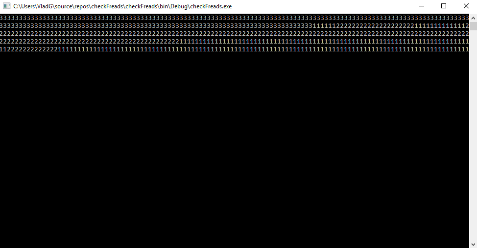

# Parallel programming and concurrency

The concurrency is a very useful technique in parallel programming, because it increases program's speed of execution (especially if we are working with databases, GUI and some pre-calculation resources). There is a possibility to protect some special algorithms (isolating them into concrete thread(S)).
Working with threads is a good practice if we want to model our system as effective as it is possible.

But, unfortunatelly, there are some disadvantages of this technique. First of all, the complexity of the program is growing, because we should synchronize some of our threads, and also we should be able to transfer data properly between the threads (especially if more than one thread has direct access to specific data i.e. common variables). Besides, could appear the problem of communication between two or more threads (for exmple, if one of threads shouldn't be executed earlier then specific one). 

At this laboratory work we deal with such a problem: in my variant exist three processes (I'll call them first, second and third process, respectively). First two depend on the third one (i.e. they can't be executed till the third is not finished). I'll say more: "The first two threads should wait till the third one will be launched and it will terminate its process". 



There are different strategies how to implement this requirement. I've choosed the following one: all indicated threads above will have access to specific one field (of boolean type, for example).
I'll call this variable _**OK**_. It it has value _true_ than it means that the third process has been launched, otherwise it wasn't launched. But, unfortunatelly, there is a problem: the fact that the process is launched doesn't gaurantee that it has been ended yet.

To solve this problem we should check if the thread is still alive. In c# class Thread has a propertie IsAlive which returns corresponding value if the thread wasn't terminated, otherwice - false.

It's everything what I need in order to implement the given laboratory work task.

Lets see some concrete aspects of my code written in .Net:

```c#
using System;
using System.Collections.Generic;
using System.Linq;
using System.Text;
using System.Threading;
using System.Threading.Tasks;

namespace checkThreads
{
    class Program
    {
        static void Main(string[] args)
        {
            Thread first = new Thread(() => Print(1));
            Thread second = new Thread(() => Print(2));
            Thread third = new Thread(() => Print(3));
            bool OK = false;
            do
            {
                if (!OK)
                {
                    third.Start();
                    OK = true;
                }
                else
                {
                    if (!third.IsAlive)
                    {
                        first.Start();
                        second.Start();
                        OK = false;
                    }
                }
            } while (OK);
            Console.ReadKey();
        }

        static void Print(int ord)
        {
            for (int i = 0; i < 200; i++)
            {
                System.Console.Write(ord);
            }
        }
    }
}

```

Thirst of all, in the code above I have initialied three threads, but didn't put them on the execution. There are some reasons why I did so.

In the next step I have set false value to the boolean variable _**OK**_. It means that the thread what I need has not been launched yet.

In the _**do-while**_ loop I'm trying to check if the third thread wasn't launched. If it's so, I'm calling the Start() method of the corresponding thread and the common variable _**OK**_ has true value right now.

The execution part of this loop is terminated, but the condition of it is true. That means that it will be executed another one time. Now the variable _**OK**_ has true value (This means that I have to check if the third thread has been terminated: if it's so the first two threads will be launched, otherwise the loop goes to next iteration).

The output:



After that the third thread has been executed, the first two were executed simultanesly (parallel). In this context I mean that the kernel was switching from first to second process and viceversa (giving each of them the concrete period to work). The kernel did so while at both processes were alive. In a moment was remaining only one process and it was working till its end.

