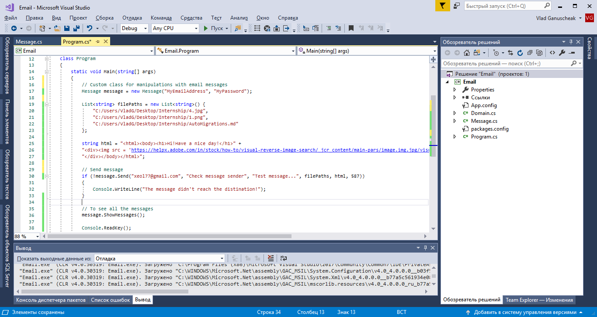
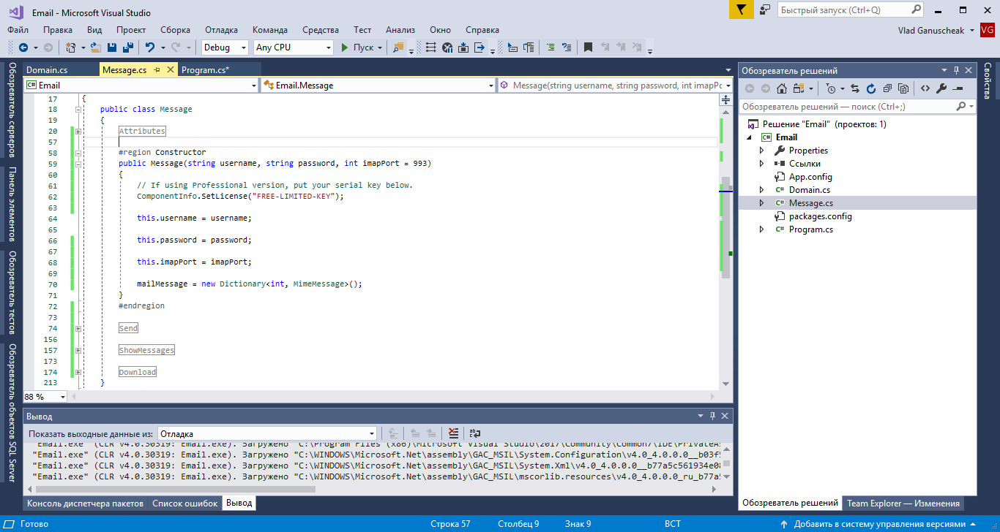
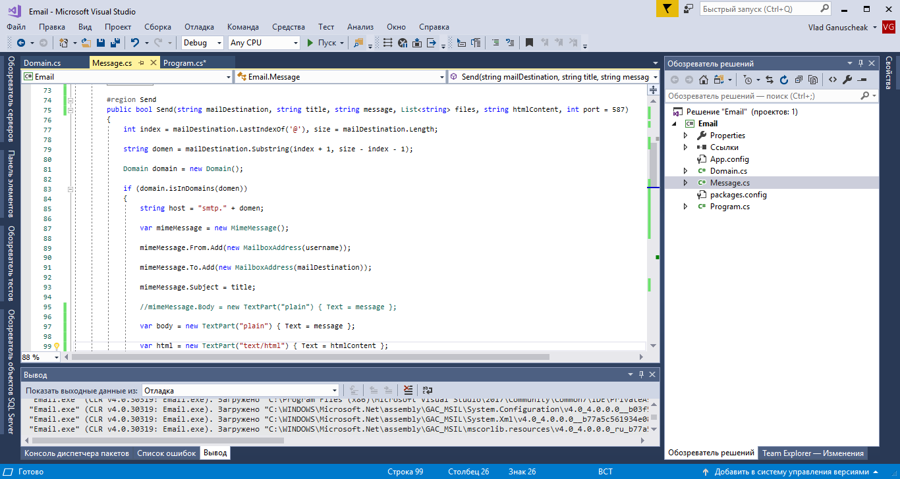
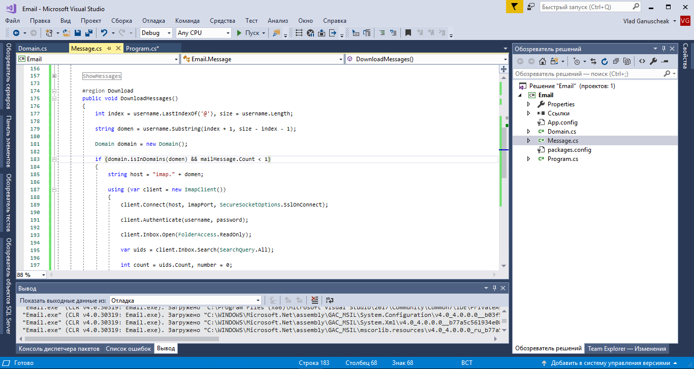
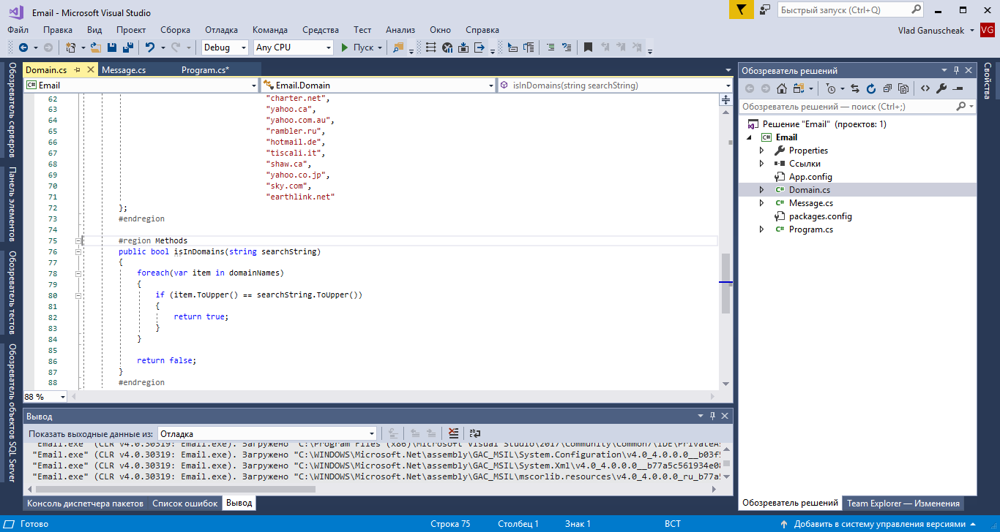
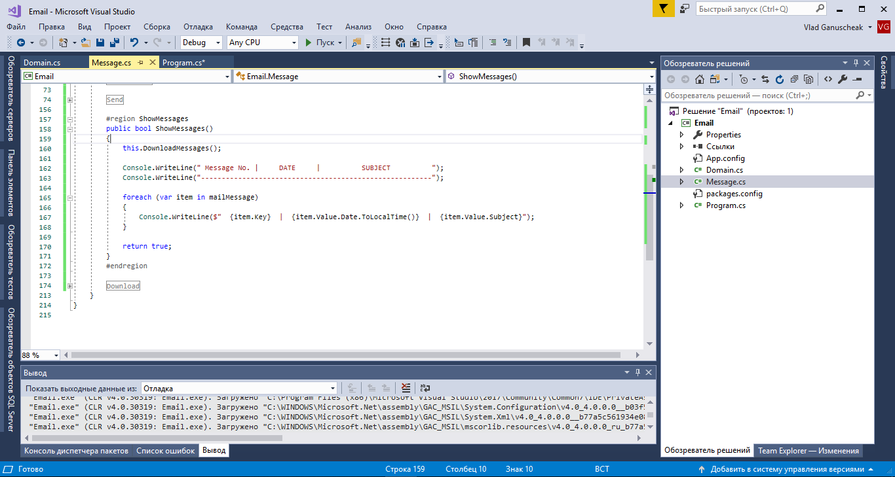
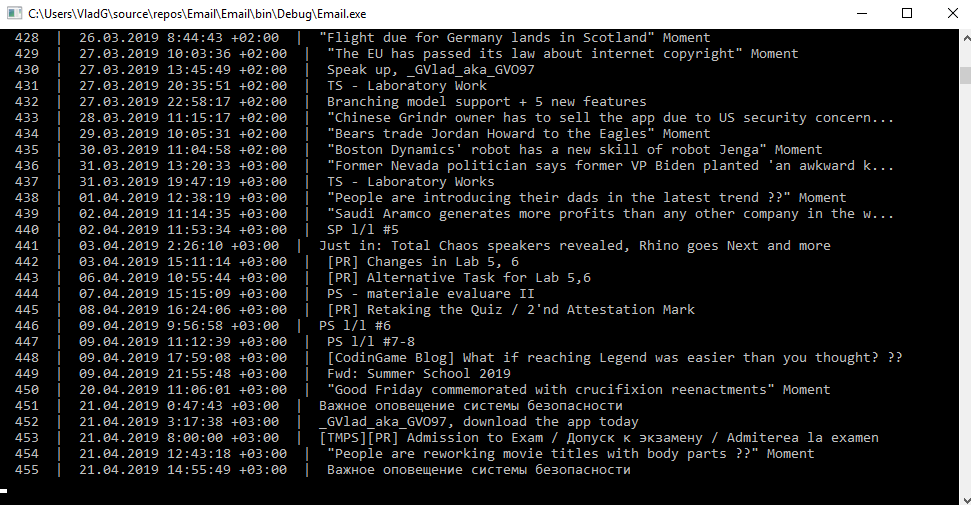

    

 
    
    
 Faculty of Computers, Informatics and 
 
    
Microelectronics 
 
    
 Technical University of Moldova

    

     
     
     
     
    
        
Network Programming

        
Laboratory work #4

    

     
     
     
    
        
 Author: 

        
 Ganusceac Vlad 

         
        
 Supervisor: 

        
 Gavrilita Mihail 

    

     
     
     
    
 2019 

    
 Chişinau 

# Task

To create simple email client which could be able to read and send messages using an existing account. As the additional tasks you can implement the following:

* Sending the message with files;

* Sending HTML forms (which include images);

* Create class POP3Header which will read the message and keep the content into dictionary.

# Implementation

In the main class there is the starting point of the application. Here I launch the _**Message**_ class which has my custom implementation of function which use MailKit and MimeKit.

In the _**Message**_ class constructor I define the values of _username_ (email address) and _password_ and the _imap port_ (by default it is 993). Also inside the constructor the Dictionary object is instantiated.

In this function there is the code that permits to send messages to users. As the input parameters it has:

*  _mailDestination_ - (the address of the email of the receiver);

* _title_ - the title of the message;

* _message_ - the text content of the sending form;

* _files_ - the list of strings where are indicated the paths to corresponding files;

* _htmlContent_ - the content of the html page saved as a string;

* port - smtp port for email domain (it may vary for different emails, but by default it is setted as 587).

`The thing that I should mention is that I use custom` _**Domain**_ `class which checks the validity of the email address (it contains ~ 40 most popular email domains).`

The _**DownloadMessage**_ class which load from the defined earler attributes messages from the remote server (i.e. gmail.com, yahoo.com, mail.ru etc.).

All extracted messages and their content are kept in the dictionary where _**Key**_ is the order of the message from the remote server and the _**Value**_ is message itself.

In this method the _Domain class is used too.

As You can see, there are a lot of domains of electronic mail defined in this class and there is a method which checks if the input parameter corresponds to one of predefined domains (indifferent of was the character in Pascal case or Camel one).

In the Show function everything is simple. It just displays the content which was extracted from the remote email into a dictionary. If the dictionary contains yet at least a field, the _** Download()**_ function shouldn't be executed inside this one i.e. the data is up to date right now and we don't need to change it.

On the picture below is ilustrated a big number of messages which have been loaded from my email. The program works comparatively fast.

# Conclusion

In order to implement all the functionality what I have done, I used the MailKit and MimeKit libraries from NuGet package Manager of Visual Studio. It has a lot of built-in methods which make programmer's life a little bit easier, but unfortunately, not all of these methods could be used for every email. It could be explained that _imap_ and _smtp_ ports may differ from server to server. Also I should mention that gmail blocks third part applications which try to synchronize their actions with it (as a solution I was forced to enable permision of the third part applications to access my account in case of valid credentials). 

The good thing of this application is that it can send messages to different mail server providers which have support of _imap_ and _smtp_. If the messages are not downloaded or are not reach the destination, it means that the user should do a little bit changes inside his/her account settings.
