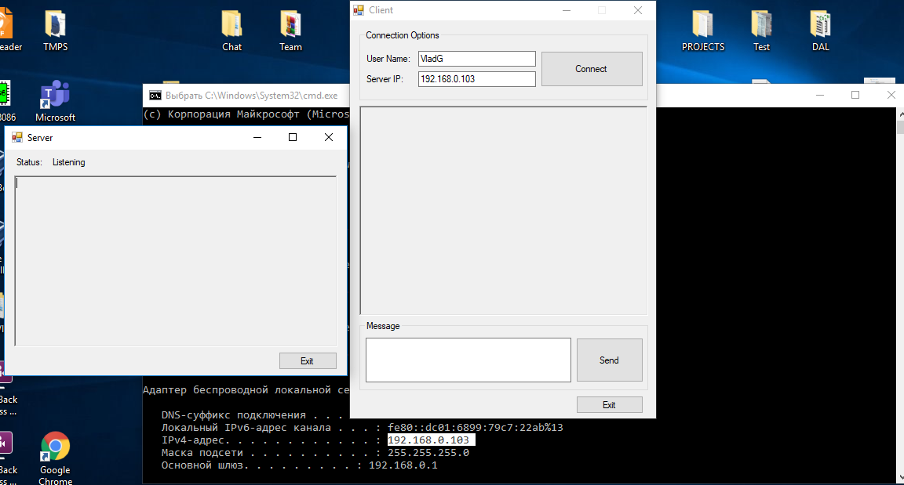

<div align="center">
    
</div>
<div align="center"> 
    <font size = 6>
    <p> Faculty of Computers, Informatics and </p> 
    <p>Microelectronics </p> 
    <p> Technical University of Moldova</p>
    </font>
</div>

<div align="center">
    <br>
    <br>
    <br>
    <br>
    <font size = 5>
        <p>Network Programming</p>
        <p>Laboratory work #5&6</p>
    </font>
</div>

<div align = "left">
    <br>
    <br>
    <br>
    <font size = 3>
        <p> Author: </p>
        <p> Ganusceac Vlad </p>
        <br>
        <p> Supervisor: </p>
        <p> Gavrilita Mihail </p>
    </font>
</div>

<div align = "center">
    <br>
    <br>
    <br>
    <p> 2019 </p>
    <p> Chişinau </p>
</div>

<P style="page-break-before: always">

# Task

To do a chat with minim interface which will be implemented using Discovery Service Pattern. Must be implemented: sockets, TCP and UDP protocols. Using UDP the server will determine all the clients connected to the chat, but TCP will have deal with data transfering.

For the maximal grade should be implemented a group chat.

# Theory

Unicast: traffic, many streams of IP packets that move across networks flow from a single point, such as a website server, to a single endpoint such as a client PC. This is the most common form of information transference on networks.

Broadcast: Here, traffic streams from a single point to all possible endpoints within reach on the network, which is generally a LAN. This is the easiest technique to ensure traffic reaches to its destinations.

This mode is mainly utilized by television networks for video and audio distribution. Even if the television network is a cable television (CATV) system, the source signal reaches to all possible destinations, which is the key reason that some channels’ content is scrambled. Broadcasting is not practicable on the public Internet due to the massive amount of unnecessary data that would continually reach at each user’s device, the complications and impact of scrambling and related privacy issues.

Multicast: In this method traffic recline between the boundaries of unicast (one point to one destination) and broadcast (one point to all destinations). And multicast is a “one source to many destinations” way of traffic distribution, means that only the destinations that openly point to their requisite to accept the data from a specific source to receive the traffic stream.

On an IP network, destinations (i.e. clients) do not regularly communicate straight to sources (i.e. servers), because the routers between source and destination must be able to regulate the topology of the network from unicast or multicast side to avoid disordered routing traffic. Multicast routers replicate packets received on one input interface and send the replicas out on multiple output interfaces.

In the multicast model, the source and destinations are almost each time “Host” and not “Routers”. The multicast traffic is spread by multicast routers across the network from source to destinations. The multicast routers must find multicast sources on the network, send out copies of packets on a number of interfaces, avoid loops, connect interested destinations with accurate source and keep the flow of unsolicited packets to a minimum. The standard protocols of multicast routing provide most of these facilities, but some router architecture cannot send multiple copies of packets and so do not support direct multicasting.


Normally, a server runs on a specific computer and has a socket that is bound to a specific port number. The server just waits, listening to the socket for a client to make a connection request.

On the client-side: The client knows the hostname of the machine on which the server is running and the port number on which the server is listening. To make a connection request, the client tries to rendezvous with the server on the server's machine and port. The client also needs to identify itself to the server so it binds to a local port number that it will use during this connection. This is usually assigned by the system.

A client's connection request
If everything goes well, the server accepts the connection. Upon acceptance, the server gets a new socket bound to the same local port and also has its remote endpoint set to the address and port of the client. It needs a new socket so that it can continue to listen to the original socket for connection requests while tending to the needs of the connected client.

The connection is made
On the client side, if the connection is accepted, a socket is successfully created and the client can use the socket to communicate with the server.

The client and server can now communicate by writing to or reading from their sockets.

`A socket is one endpoint of a two-way communication link between two programs running on the network. A socket is bound to a port number so that the TCP layer can identify the application that data is destined to be sent to.`

# Implementation

When the application is built first, the OS will ask us if it should block or permit the application to do modification on the system.



The final application looks like following:

* There is a possibility to launch multiple forms where the application will autocomplete the local IP and the remote one. IN my case these two IP addresses will be the same, because I'll test the application on the same machine.

* PORT: this field is strictly required for local and remote clients. The local port of the first client will be as the remote one for the second client, and viceversa.

* The Connect button binds actions of two clients on the server using TCP/UDP protocols ans sockets where they are used.

* The Send button sends the message to common chat.


The main interest for us is playing not the design and the frontend features, but the code behind all of them.

In the constructor method besides that fact that all the items are loaded, there are some significant features:

* First of all, here is initialized variable of socket class type and this instance of the class will deal with UDP protocol.

* Secondly, this soket will be reusable. That means that it will be loaded simultanously a lot of types to check the state of all elements connected with it.


As I have mentioned earlier, the server and clients have the same address, because the application is launched and used by clients on the same device. That's why it is important to determine programmaticaly the IP address of the server. And, of course, after that to share between users (clients).


When everything is done, the last step is to connect clients using the server. In this case the server is in so called role as a mediator. Frankly speaking, each task can be treated in a different way: my implementation is a static one (uses Mediator and the maximum number of the clients is finite), another one is to use Discovery Search pattern. The idea is quit clear: in the chat may be added a lot of users in any time segment. The implementation of the approximate thing could be seen here:
https://www.youtube.com/watch?v=uoUJxb6r7SU.


When we are connecting two remote clients using socket, we must know the endpoint of the first and the second one user. The first one is binded to socket, but the second one is connected to the first one. The same procedure is repeated for all members which are in the network graph.

For such manipulations are used:

* IPEndPoint class:

```
    The IPEndPoint class contains the host and local or remote port information needed by an application to connect to a service on a host. By combining the host's IP address and port number of a service, the IPEndPoint class forms a connection point to a service.
```

* BeginReceiveForm method of socket:

```
It begins to asynchronously receive data from a specified network device.
```

Between parameters of this method there are:

* buffer - an array of type Byte that is the storage location for the received data;

* offset - the zero-based position in the buffer parameter at which to store the data;

* size - the number of bytes to receive;

* socketFlags - a bitwise combination of the SocketFlags values;

* remoteEP - an EndPoint that represents the source of the data;

* callback - the AsyncCallback delegate;

* state - an object that contains state information for this request.

As the result this function (method) returns an IAsyncResult (whic references to asynchronous read).


As it was mentioned above, the functionality of this type of application is impossible to do without custom callback method. Mine implementation of the mentioned method looks like this:


To have real time communication between members of the application, the socket should transmit some data. This data is of type byte[] and is transmited using the built-in Send() method.


# Conclusion 

UDP & ICP:

1. Tangency points

    * TCP and UDP are network protocols that are used to send data packets. These data packets are just bits of data that travel over the internet. When you chat with your friend online, send an email, or send a page request through your browser, you send online data. This data is transferred in the form of tiny packets.

    * Both TCP and UDP forward the data packets from your device using ports to different routers until they reach the final destination. They are also used to send the packets to the IP address of the recipient. (An IP address is a special address that is assigned to each device connected to the internet.)

    * Both TCP and UDP work on top of the IP (Internet Protocol). This is why you might hear terms such as TCP/IP or UDP/IP. However, since TCP/IP and UDP/IP are used very often, they are referred to as just TCP and UDP.

2. Difference

    * TCP (Transmission Control Protocol) is connection oriented, whereas UDP (User Datagram Protocol) is connection-less. This means that TCP tracks all data sent, requiring acknowledgment for each octet (generally). UDP does not use acknowledgments at all, and is usually used for protocols where a few lost datagrams do not matter.

    * Because of acknowledgments, TCP is considered a reliable data transfer protocol. It ensures that no data is sent to the upper layer application that is out of order, duplicated, or has missing pieces. It can even manage transmissions to attempt to reduce congestion.

    * UDP is a very lightweight protocol defined in RFC 768. The primary uses for UDP include service advertisements, such as routing protocol updates and server availability, one-to-many multicast applications, and streaming applications, such as voice and video, where a lost datagram is far less important than an out-of-order datagram.

Sockets:

A network socket is an internal endpoint for sending or receiving data within a node on a computer network. Concretely, it is a representation of this endpoint in networking software (protocol stack), such as an entry in a table (listing communication protocol, destination, status, etc.), and is a form of system resource.

Types:

* Datagram socket

    * A datagram socket is a type of network socket which provides a connectionless point for sending or receiving data packets. Each packet sent or received on a datagram socket is individually addressed and routed. Order and reliability are not guaranteed with datagram sockets, so multiple packets sent from one machine or process to another may arrive in any order or might not arrive at all.

    * The sending of UDP broadcasts on a network are always enabled on a datagram socket. In order to receive broadcast packets, a datagram socket should be bound to the wildcard address. Broadcast packets may also be received when a datagram socket is bound to a more specific address.

* Stream socket

    * A stream socket is a type of network socket which provides a connection-oriented, sequenced, and unique flow of data without record boundaries, with well-defined mechanisms for creating and destroying connections and for detecting errors.

    * A stream socket transmits data reliably, in order, and with out-of-band capabilities.

    * On the Internet, stream sockets are typically implemented on top of TCP so that applications can run across any networks using TCP/IP protocol. SCTP may also be used for stream sockets.

* Raw socket

    * A raw socket is a network socket that allows direct sending and receiving of IP packets without any protocol-specific transport layer formatting.

    * With other types of sockets, the payload is automatically encapsulated according to the chosen transport layer protocol (e.g. TCP, UDP), and the socket user is unaware of the existence of protocol headers that are broadcast with the payload. When reading from a raw socket, the headers are usually included. When transmitting packets from a raw socket, the automatic addition of a header is optional.

    * Raw sockets are used in security related applications like Nmap. One possible use case for raw sockets is the implementation of new transport-layer protocols in user space.Raw sockets are typically available in network equipment, and used for routing protocols such as the Internet Group Management Protocol (IGMPv4) and Open Shortest Path First (OSPF), and in the Internet Control Message Protocol (ICMP) used, among other things, by the ping utility.