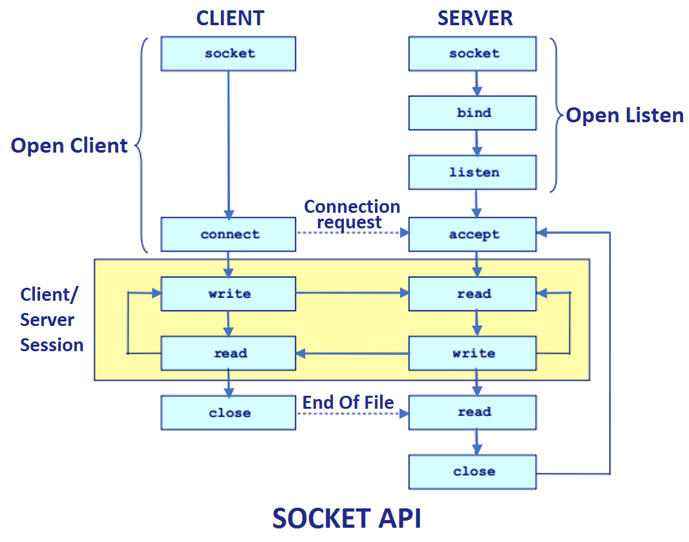

## Theory

A network socket is an internal endpoint for sending or receiving data within a node on a computer network. Concretely, it is a representation of this endpoint in networking software (protocol stack), such as an entry in a table (listing communication protocol, destination, status, etc.), and is a form of system resource.



A process can refer to a socket using a socket descriptor, a type of handle. A process first requests that the protocol stack create a socket, and the stack returns a descriptor to the process so it can identify the socket. The process then passes the descriptor back to the protocol stack when it wishes to send or receive data using this socket.

Unlike ports, sockets are _**specific to one node**_; they are _**local**_ resources and cannot be referred to directly by other nodes. Further, sockets are not necessarily associated with a persistent connection (channel) for communication between two nodes, nor is there necessarily some single other endpoint. For example, a datagram socket can be used for connectionless communication, and a multicast socket can be used to send to multiple nodes. However, in practice for internet communication, sockets are generally used to connect to a specific endpoint and often with a persistent connection.

_**TCP**_ provides reliable, ordered, and error-checked delivery of a stream of octets (bytes) between applications running on hosts communicating via an IP network.

With _**UDP**_, computer applications can send messages, in this case referred to as datagrams, to other hosts on an Internet Protocol (IP) network. Prior communications are not required in order to set up communication channels or data paths.

***

## Task 

_**Realizarea unui chat cu interfață minimă care va fi implementat utilizind Discovery Service Pattern. Vor if implementate socket-urile, TCP și UDP protocoale. Prin intermediul UDP, serverul va determina toți clienții (utilizatorii) conectați la chat, iar TCP se va ocupa cu transmiterea mesajelor. Pentru nota 10: sa fie posibilă realizat un group chat.**_

## Implementation

The whole implementation of this task may be divided into two main parts: clien side code and server's one.

**Client side code**

First of all, we should establish the remote endpoint for the socket. Let use 111111 as a port on our local computer.

```c#
    IPHostEntry ipHost = Dns.GetHostEntry(Dns.GetHostName()); 
    IPAddress ipAddr = ipHost.AddressList[0]; 
    IPEndPoint localEndPoint = new IPEndPoint(ipAddr, 11111); 
```

The next step is to create TCP/IP socket

```c#
Socket sender = new Socket(ipAddr.AddressFamily, 
                   SocketType.Stream, ProtocolType.Tcp); 
```

The Socket class has build-in method COnnect(). We will use it, because we should connect to the remote point (server).

```c#
sender.Connect(localEndPoint);
```

The way we can send message to the server:

```c#
byte[] messageSent = Encoding.ASCII.GetBytes("Test Client<EOF>"); 
            int byteSent = sender.Send(messageSent);
```

In order to receive message from the server side, we must write the following lines:

```c#
byte[] messageReceived = new byte[1024]; 
  
int byteRecv = sender.Receive(messageReceived); 
    Console.WriteLine("Message from Server -> {0}",  
           Encoding.ASCII.GetString(messageReceived,  
                                             0, byteRecv)); 
```

The idea is that the server gives us a string which contains the message. Also it keeps the length of the corresponding data and the content of the responce is encoded.

It is a good practice to close the connection to the server when the necessary actions have been done:

```c#
sender.Shutdown(SocketShutdown.Both); 
            sender.Close(); 
```

The code above may be put into several *try-catch* blocks, because during some requests we can achieve such exceptions as _ArgumentNullException_, _SocketException_ or any other one (depending on what or how we gonna change).

**Server side code**

First of all, we need to establish the local endpoint for a socket.

```c# 
    IPHostEntry ipHost = Dns.GetHostEntry(Dns.GetHostName()); 
    IPAddress ipAddr = ipHost.AddressList[0]; 
    IPEndPoint localEndPoint = new IPEndPoint(ipAddr, 11111);
```

DNS' class method GetHostName returns the name of host of the currently running application.

In case of server we must create a listener:

```c#
Socket listener = new Socket(ipAddr.AddressFamily, 
                 SocketType.Stream, ProtocolType.Tcp);
```

All we have to do now is to associate a network address to the Server's socket. So in order to connect to this server, the user should know the network address.

```c#
    listener.Bind(localEndPoint); 
```

Also it is important to establish the maximum number of the queries which our local socket will accept.

```c# 
    listener.Listen(10); 
```

So, in the example above only ten users may interractionate between themselves on the server. I think that is preaty enough for this small application.

Now it is important to accept the connection to the user:

```c#
    Socket clientSocket = listener.Accept();  
```

In the server side the operations above data buffer should be permanent. That's why, in the code below I'm reading the requests till one of them is empty.

But the logic of convertion data into array of bytes and receiving the length of the corresponding message is the same as I have mebntioned in another logic part implementation.

```c#
    byte[] bytes = new Byte[1024]; 
            string data = null; 
  
            while (true) { 
  
                int numByte = clientSocket.Receive(bytes); 
                  
                data += Encoding.ASCII.GetString(bytes, 
                                           0, numByte); 
                                             
                if (data.IndexOf("<EOF>") > -1) 
                    break; 
            }
```

When we gonna stop our server, we should close the server's endpoint socket. And this thing could be done by the same way as I mentioned in another logic part.

_Thing to remember is that working with TCP/IP we should use at least one **try-catch** block to prevent any unexpected behaviour_.

## Result

The concrete result You may see on the images below:


