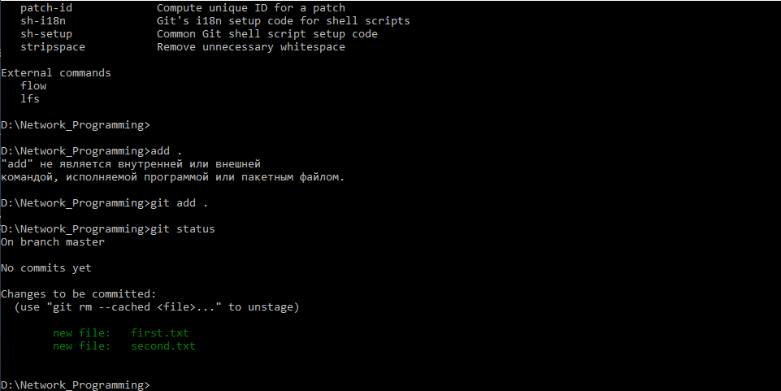

# _**Versionarea codului sursă utilizînd GIT**_

## _**Scopul lucrarii**_

Lucrarea de laborator are ca scop studiul și înțelegerea principiilor de funcționare și utilizare a sistemului distribuit de control al versiunilor numit GIT. 

## _**Obiectivele**_

Crearea unui repozitoriu distant, localizat de serviciul _github_, și sincronizarea tuturor modificărilor efectuate asupra repozitoriului local.

### _Ce este VCS ?_

Sistemele de versionare (VCS, Version Control Systems - eng.) servesc la gestionarea versiunilor multiple ale fișierelor incluse într-un proiect colaborativ. Fiecare modificare efectuată asupra elementului de proiect se memorizează împreună cu autorului schimbării. Important de menționat că în orice moment de timp se poate reveni la o versiune anterioară a entității.

Motivatia principala consta in posibilitatea ca diferiti membri ai echipei, aflati eventual in spatii geografice indepartate, sa poata lucra simultan la proiect, urmand ca, la final, modificarile lor sa fie reunite in noi versiuni ale proiectului. De asemenea, exista si alte avantaje. Cand se observa un bug, se poate reveni la o versiune anterioara, in vederea determinarii momentului introducerii acestuia in program. In acelasi timp, se poate urma o dezvoltare pe ramuri (branches), in care se lucreaza, in paralel, la multiple versiuni ale proiectului - de exemplu, una in care se doreste inlaturarea bug-urilor, iar cealalta, in care se urmareste adaugarea de noi functionalitati, inaintea slefuirii celor existente.

### _Terminologie_

_repository_ - pe server, conține ierarhia de fișiere și informațiile de versiune;

_working copy_ - varianta locală, obținuta de la server, pe care se fac modificările;

_revision_  - o versiune a unui document. (v1, v2, v3...).

_checkout_ - aducerea pe masina locala a versiunii de pe server, sub forma unei working copy

_update/pull_: actualizarea repozitoriului local în funcție de modificările survenite, intre timp, pe server. Se aduc doar fișierele modificate;

_commit_ - înregistrează o nouă versiune a fișierului (fișierelor) modificat în repozitoriu.

_commit message_ -  un mesaj asociat unei acțiuni commit care descrie schimbările făcute în noua versiune.

_changelog_ - o listă a versiunilor (commit-urilor) unui fișier/proiect de obicei însoțită de mesajele asociate fiecărui commit.  

_diff_: Afișează diferențele dintre două versiuni a unui fișier sau dintre fișierul modificat local (pe working copy) și o versiune de pe repository.

_revert_ - renunțarea la ultimele modificări (locale) făcute într-un fișier din working copy, și revenirea la ultima versiune aflată în repozitoriu sau la o versiune la alegere.

_branch_ - creează o “copie” a unui fișier/proiect pentru modificări „în paralel” fără a afecta starea actuală a unui proiect.

_merge_ - aplică ultimele modificări dintr-o versiune a unui fișier peste alt fișier;

_conflict_ - situația în care un merge nu se poate executa automat și modificările locale sunt în conflict cu modificările din repozitoriu.

_resolve_: rezolvarea (de obicei manuală) a conflictelor apărute într-un fișier după un merge.

## _**Proces de lucru**_

Initial trebuie de creat folder pentru a pastra copia  repozitoriului de pe Github. Repozitoriu local va fi pastrat pe diskul D. Acolo creez folder Network_Programming (el fiind numele de repositoriu). Toate manipulatiile fac cu _Command Line_ (**cmd**) si cu ajutorul ei ajung direct in centrul folderului creat.

    d:
    mkdir Network_Programming
    cd Network_Programming

Ca sa lucrez cu git comenzile, trebuie sa scriu PATHurile globale de git/bin si git/cmd in Windows.

Aici eu initializes gitul. In repozitoriu local va fi creat git folder in care va fi pastrata toata istoria modificarii continutului din folder respectiv (adaugarea, stergerea si modificarea continutului).

    git init

E timp sa creez cateva filuri, pentru ca repozitoriu dat inca nu contine nici un file. Cu ajutorul comenzii _echo_ din **cmd** creez filuri cu careva continut intre ele. 

    echo "First file to be commited" > first.txt
    echo "This is my second file..." > second.txt

Verific daca au fost adaugate filurile respective.

    dir

Toata lista comenzilor de git poate fi vazuta, daca o sa introduc urmatoarea comanda:

    git help -a

Ca sa continuu lucru trebuie sa apas una din urmatoarele comenzi:

    CTRL+C

sau

    Q

E timpul sa adaug modificarile pe care am facut in repozitoriu local pe cel global din Github. Initial pe Gitul meu trebuie sa fie creat un repo gol care are aceeasi nume ca si cel local: _Network_Programming_

Cu azutorul comenzii _git status_ pot sa vad cum se petrec modificarile respective.

    git add .
    git status

Pentru a face un commit trebuie de scris comanda de jos si sa adauge un comentariu ca mai apoi sa fie clar cu ce fel de modificari eu am treaba la acest commit. Commitul acesta este initial.

    git commit -m "First commit"
    git status

Aici trebuie sa conectez repozitoriu local cu cel de la git. La git initial a fos creat un repo gol. Daca acela repozitoriul ar fi continea careva fisiere care nu-s prezente in directoriu meu local, ar fi nevoit sa utilizez _pull_ comanda.

    git remote add origin https://github.com/VladGanuscheak/Network_Programming

Daca conexiune ar fi existat deja, sistemul ar da urmatorul mesaj: _**fatal: remote origin already exists**_.

Acum tremit toate modificarile pe Github:

    git push -u origin master

Scriind urmatoarea comanda 

    git status

verific ca operatia data s-a finisat cu succes!

Cind lucram cu git, deseori ne utilizam diferite ramuri (dev, releas, hotfix etc.). Aici creez unul dintre ele:

    git branch dev
    git checkout dev

Comenzile de mai sus ar fi putut sa fie scrise in forma urmatoare:
    
    git checkout -b dev

In codul de mai jos le unific ramurile dev cu master si reinnoiesc repozitoriu distant:

    git push --set-upstream origin dev
    git merge dev
    git push origin master

